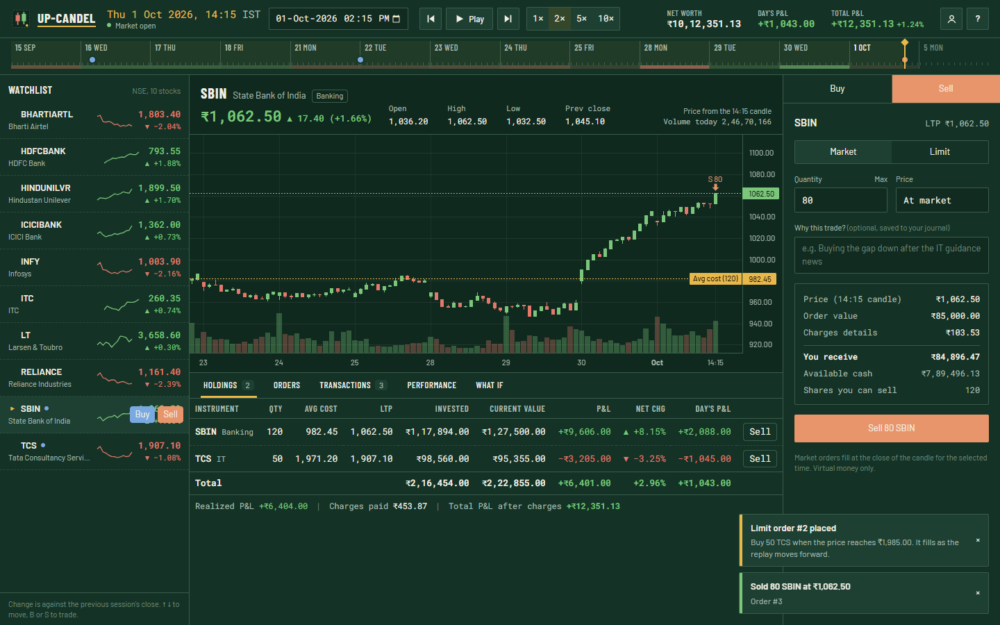

# Up-Candel

A virtual stock trading platform. You get ₹10 lakh of pretend money and ten NSE stocks, and you trade them on a market you can replay, pause and rewind across 14 trading days of 30-minute candles. No real money moves anywhere.



## What it does

Every requirement from the brief, and where it lives:

| Requirement | Where to find it |
|---|---|
| View available stocks | Watchlist on the left: 10 NSE large caps with price, change and an intraday sparkline |
| View changing stock prices | Press Play. The clock moves one 30-minute candle at a time (1x to 10x) and every price, chart and P&L figure updates with it |
| Price at a selected date and time | The date/time picker in the top bar, or click anywhere on the day tape under it. Prices come from the matching row of the CSV data |
| Buy and sell with virtual money | Order ticket on the right. Market and limit orders, with cash and holdings checks |
| Portfolio | Holdings tab: quantity, average cost, LTP, current value |
| Profit and loss | Unrealized, realized, day's P&L and total P&L after charges, per stock and overall |
| Transaction history | Transactions tab, with charges, realized P&L per sale, your trade notes and a CSV export |
| Single predefined user, no login | One seeded account ("Demo Trader"), no auth |

A few things I added on top, because a trading screen felt incomplete without them:

- **Replay tape.** Every trading day is one segment. The playhead shows where the clock is, a dot marks each of your trades, and days you've already replayed get tinted green or red by how the whole market did. Days ahead stay blank, so the tape never gives away the future. The replay stops on the last candle of the data, where Play turns into Replay and starts again from the first.
- **Limit orders that fill during replay.** A buy limit below the market rests in the Orders tab and fills when a later candle's low reaches it. If a candle gaps below your limit you get the better price (the open), which is how real fills work.
- **Real charges.** STT, exchange fee, SEBI fee, stamp duty, GST and the DP charge, at Zerodha's published delivery rates. You can switch them off in the account dialog.
- **You vs the market.** The Performance tab plots your net worth against an equal-weight basket of all ten stocks that started with the same cash, plus win rate, max drawdown and best and worst sells.
- **What if.** Pick an amount and a moment, and see what each stock would have turned it into by now. Hindsight on purpose, and a quick way to find a moment worth going back to.
- **Keyboard shortcuts** in the style of Kite: B and S to trade, Space to play, arrow keys to step and move through the watchlist, `?` for the full list.
- **Trade journal.** Every order takes an optional note ("why this trade?") that stays with the transaction and the CSV export.

## Running it

You need Node 22.12 or newer.

```bash
npm install
npm run dev
```

Open http://localhost:5173. The API runs on port 3001 and Vite proxies `/api` to it.

For a production-style run, one process serves both the API and the built app:

```bash
npm run build
npm start          # http://localhost:3001
```

Other scripts:

```bash
npm test               # 67 tests: data, pricing, trading rules, P&L invariants, limit fills, charges, clock edges, API validation
npm run typecheck
npm run generate-data  # rebuilds the CSVs in data/ (same seed, same output)
```

## The market data

`data/stocks.csv` lists the ten stocks. `data/prices/<SYMBOL>.csv` holds the candles, one row per 30 minutes:

```
timestamp,open,high,low,close,volume
2026-09-15T09:15:00+05:30,2092.30,2092.30,2076.20,2079.00,447854
```

- **Window:** it starts on 14 Sep 2026 and runs for the next 14 trading days, which lands on 15 Sep to 5 Oct. Three kinds of day are missing from it: weekends, Mon 14 Sep (Ganesh Chaturthi) and Fri 2 Oct (Gandhi Jayanti), both NSE holidays. That gap in the middle is worth showing in a demo, since the app has to price and label a closed day correctly.
- **Candles follow NSE's session:** 09:15 to 15:30 IST, so a day has 13 candles (09:15, 09:45 ... 15:15). The last one is only 15 minutes long, same as on Kite.
- **Size:** 10 stocks x 14 days x 13 candles = 1,820 rows.
- **Prices start near real early-September 2026 levels** (RELIANCE ~₹1,240, TCS ~₹2,110 and so on) but everything after that is synthetic.

The brief suggested generating the data with ChatGPT. I wrote a small generator instead (`scripts/generate-data.ts`), mainly so the numbers are reproducible and actually behave like a market:

- Each 30-minute move mixes a market factor, a sector factor and stock-specific noise, so the three banks tend to move together and the whole market has good and bad days.
- Days open with an overnight gap. Volatility and volume are higher at the open and close than at lunch (the usual U shape).
- High and low come from a simulated path inside each candle, so every candle is internally consistent.
- Prices sit on NSE's tick grid (₹0.01 under ₹250, ₹0.05 up to ₹1,000, ₹0.10 up to ₹5,000).
- There are three scripted news days, so the replay has moments worth trading around: Bharti Airtel gaps up on 18 Sep, TCS and Infosys gap down on 22 Sep, SBI gaps up on 30 Sep.
- The seed is fixed, so rerunning it gives byte-identical files.

On startup the server loads the CSVs into SQLite (the `stocks` and `candles` tables), which makes the CSVs the source of truth. Orders and trades live in the same database file under `var/`.

## How the trading rules work

**Price at a time.** A candle is labelled by its start time, like Kite and TradingView do. The price at a selected moment T is the close of the latest candle that started at or before T. Pick 10:15 and you get the 10:15 row; pick 10:40 and it's still the 10:15 row. Before the first candle you see the previous close.

**When you can trade.** Only 09:15 to 15:30 on trading days. At any other time the ticket says why and offers a button to jump to the next open.

**Orders.**
- Market orders fill at the price for the selected time.
- A limit order at or through the market fills straight away at the market price. Otherwise it rests, and its cash is held aside so you can't spend it twice.
- Limit prices have to be on the tick grid and inside ±10% of the previous close (the dynamic band for F&O stocks).
- Buys need enough available cash for value plus charges. You can't sell more than you hold; there's no short selling.

**P&L uses the weighted average cost method.** A buy updates the average; a sale books realized P&L against it and leaves the average alone. Money is stored as integer paise throughout, so no floating point error creeps into totals. Net worth minus starting cash always equals realized + unrealized - charges, and a test checks that.

Real brokers and the tax department use FIFO lot matching instead of a running average. For a paper-trading app I think average cost is easier to read, but it's worth knowing the difference.

**Moving through time.** This part needed rules, since the brief asks for prices at any selected time and you can also trade at that time.
- Everything you see is *as of* the clock. Jump back to 17 Sep after trading on 1 Oct and the holdings, cash and history show exactly what you had on the 17th. Later trades show as faded dots on the tape.
- You can trade at any open market time, including before trades you have already made. Before accepting a back-dated order the engine replays the whole ledger in time order, and refuses it only if one of your later trades would end up short of cash or shares. So selling 100 shares on 1 Oct and then going back to 17 Sep to sell the same 100 is refused, and the message names the trade it clashes with.
- Looking ahead is free. If you have a limit order waiting and scrub past the moment it would fill, you'll see it filled, but nothing is saved until you actually trade at or after that time. So you can peek at 1 Oct and still come back and trade on 17 Sep.

## API

All times are epoch seconds and all money is paise. Every read takes `?at=` for the simulated time.

| Method | Path | What it returns |
|---|---|---|
| GET | `/api/meta` | Data range, candle timeline, trading days, stocks, account |
| GET | `/api/market?at=` | Market status and a quote for every stock |
| GET | `/api/stocks/:symbol/candles?at=` | Candles up to `at` |
| GET | `/api/portfolio?at=` | Cash, holdings, P&L summary |
| GET | `/api/orders?at=` | Orders with their status as of `at` |
| GET | `/api/transactions?at=` | Trade history (`&format=csv` for a download) |
| GET | `/api/performance?at=` | Net worth curve, market benchmark, stats |
| GET | `/api/what-if?from=&at=&amount=` | Hindsight returns for every stock |
| POST | `/api/orders` | Place an order: `{ symbol, side, type, qty, limitPrice?, at, note? }` (limit price in rupees) |
| POST | `/api/orders/:id/cancel` | Cancel an open limit order: `{ at }` |
| PATCH | `/api/account` | `{ chargesEnabled }` |
| POST | `/api/account/reset` | `{ startingCash, chargesEnabled }` (rupees) |

Errors come back as `{ "error": { "code": "INSUFFICIENT_FUNDS", "message": "..." } }` with a 4xx status, and the UI shows the message as is.

## Project layout

```
data/                  CSV market data (committed)
scripts/               data generator
shared/                market rules and charges, used by server and client
server/
  db.ts                schema, CSV loading
  market.ts            candle index, quotes, market status
  engine.ts            orders, fills, ledger, P&L, performance
  app.ts               Express routes
client/src/            React app (Vite, Tailwind, lightweight-charts)
tests/                 Vitest + supertest
```

Stack: React 19, TypeScript, Vite 8, Tailwind 4, TradingView's lightweight-charts, Express 5, SQLite through better-sqlite3, zod for request validation.

## Deploying

`render.yaml` sets up a free Render web service: build with `npm ci && npm run build`, start with `npm start`. One thing to know about Render's free tier: it sleeps after 15 idle minutes and has no persistent disk, so the demo account resets to fresh cash when it wakes up. The market data always reloads from the CSVs, so nothing else is lost.

## Assumptions

- One user, no login, as the brief allows.
- Delivery (CNC) trades only. No intraday margin, no F&O, no short selling.
- Market orders fill at the candle close with no slippage.
- The DP charge is taken once per stock per day on the first sale, like a contract note.
- The data is synthetic and says nothing about how these companies actually traded.
